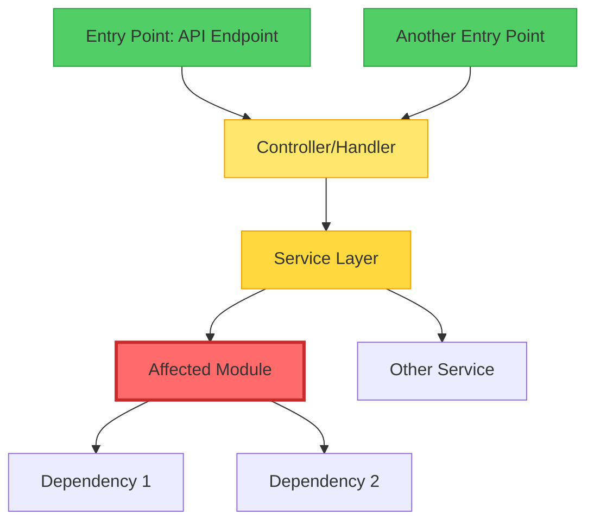

# Incident Postmortem Analysis Skill

This skill enables comprehensive incident analysis by parsing error logs, tracing errors to source code, mapping dependency chains, finding root cause commits, and generating structured postmortem reports with proposed fixes.

## Workflow Overview

Execute the following phases sequentially to perform a complete incident postmortem analysis:

1. **Error Log Analysis** - Parse and understand the incident
2. **Source Code Investigation** - Identify affected code
3. **Dependency Chain Mapping** - Visualize impact radius
4. **Git History Analysis** - Find the root cause commit
5. **Postmortem Report Generation** - Document findings
6. **Fix Proposal & Application** - Resolve the issue

---

## Phase 1: Error Log Analysis

### Objective
Parse error logs to extract critical incident information and establish the initial timeline.

### Instructions

1. **Request Log Information**
   - Use `ask_followup_question` to request the log file path or ask user to paste log content
   - Ask about the incident timeframe if not obvious from logs
   - Clarify if there are multiple log sources to analyze

2. **Read and Parse Logs**
   - If log file path provided, use `read_file` to access the content
   - Support multiple formats: JSON logs, plain text, structured logs, stack traces
   - Parse systematically to extract:
     - **Error Type**: Exception class, error code, or error message pattern
     - **Error Message**: Full error description
     - **Timestamps**: First occurrence, last occurrence, frequency pattern
     - **Frequency**: Count of occurrences (search for duplicate patterns)
     - **Stack Traces**: Full call stack if available
     - **Context**: Request IDs, user IDs, affected endpoints, environment info

3. **Identify Patterns**
   - Use `search_files` with regex to find similar error patterns across log files
   - Group related errors together
   - Identify if this is a single incident or multiple related issues
   - Note any correlation with deployments, time of day, or specific operations

4. **Extract File References**
   - Parse stack traces to identify:
     - File paths (absolute or relative)
     - Line numbers where errors occurred
     - Function/method names in the call stack
   - Create a list of all affected files for investigation

5. **Create Initial Timeline**
   - Document:
     - First error occurrence timestamp
     - Peak error rate period
     - Last known occurrence
     - Total duration of incident
     - Detection time (when team became aware)

### Output Format
Create a structured summary:
```
ERROR ANALYSIS SUMMARY
======================
Error Type: [Exception/Error name]
Error Message: [Primary error message]
First Occurrence: [Timestamp]
Last Occurrence: [Timestamp]
Total Occurrences: [Count]
Duration: [Time span]

Affected Files:
- [file1.ext:line_number]
- [file2.ext:line_number]

Stack Trace Pattern:
[Most common stack trace]
```

---

## Phase 2: Source Code Investigation

### Objective
Examine the source code to understand the failure point and identify the root cause location.

### Instructions

1. **Read Affected Files**
   - Use `read_file` to examine all files identified in Phase 1
   - Read multiple related files together (up to 5) for efficiency
   - Focus on the specific line numbers mentioned in stack traces
   - Include surrounding context (±20 lines) to understand the code flow

2. **Identify Code Definitions**
   - Use `list_code_definition_names` on affected files to see all functions/classes
   - Identify the specific function/method where the error originated
   - Note the function signature, parameters, and return type

3. **Analyze the Failure Point**
   - Examine the code logic at the error location
   - Look for:
     - Null/undefined checks missing
     - Type mismatches
     - Array/collection boundary issues
     - Resource handling problems (file, network, database)
     - Race conditions or timing issues
     - Configuration or environment dependencies
     - Input validation gaps

4. **Search for Related Code**
   - Use `search_files` to find:
     - Other places calling the failing function
     - Similar code patterns that might have the same issue
     - Related error handling code
     - Test files covering this functionality

5. **Understand the Context**
   - Read the surrounding code to understand:
     - What the function is supposed to do
     - What inputs it expects
     - What assumptions it makes
     - How it's being called in the error scenario

6. **Identify the Primary Failure Point**
   - Determine the exact line(s) of code causing the error
   - Distinguish between:
     - **Symptom**: Where the error manifests
     - **Root Cause**: Where the actual problem originates
   - The root cause may be in a different file than where the error appears

### Output Format
```
SOURCE CODE ANALYSIS
====================
Primary Failure Point:
File: [path/to/file.ext]
Function: [function_name]
Line: [line_number]

Code Context:
[Relevant code snippet with line numbers]

Analysis:
[Explanation of what the code does and why it fails]

Root Cause Location:
[If different from failure point, specify the actual source of the problem]
```

---

## Phase 3: Dependency Chain Mapping

### Objective
Create a visual dependency map showing how the error propagates through the codebase and identify the full impact radius.

### Instructions

1. **Analyze Import/Require Statements**
   - In the affected file, identify all imports/requires/includes
   - Use `read_file` to examine these dependencies
   - Note which external modules, libraries, or internal modules are used

2. **Find Upstream Dependencies**
   - Use `search_files` with patterns like:
     - `import.*from.*[affected_module]`
     - `require\(['"].*[affected_module]`
     - `#include.*[affected_file]`
     - `using.*[affected_namespace]`
   - Identify all files that import or depend on the affected module
   - This shows the **impact radius** - what else could be affected

3. **Find Downstream Dependencies**
   - Identify what the affected module depends on
   - Trace the call chain from entry point to failure point
   - Map the data flow through the system

4. **Build Dependency Graph**
   - Create a hierarchical structure:
     - **Entry Points**: API endpoints, event handlers, scheduled jobs
     - **Intermediate Layers**: Services, controllers, utilities
     - **Affected Module**: The module with the bug
     - **Dependencies**: What the affected module uses
   - Note circular dependencies if any exist

5. **Generate Mermaid Diagram**
   - Create a flowchart showing the dependency chain
   - Use color coding:
     - **Red (#ff6b6b)**: The module with the actual bug
     - **Orange (#ffd93d)**: Modules directly calling the buggy code
     - **Yellow (#ffe66d)**: Modules indirectly affected
     - **Green (#51cf66)**: Entry points/external interfaces
   - Include directional arrows showing data/control flow
   - Add labels for key functions or operations

### Mermaid Diagram Template


### Output Format
```
DEPENDENCY CHAIN ANALYSIS
=========================

Upstream Dependencies (Impact Radius):
- [file1.ext] → calls affected module
- [file2.ext] → calls affected module
- [file3.ext] → indirectly affected

Downstream Dependencies:
- [affected_module] → depends on [dependency1]
- [affected_module] → depends on [dependency2]

Entry Points:
- [API endpoint or event handler]
- [Scheduled job or background task]

[Mermaid diagram here]

Impact Assessment:
- Direct impact: [X] files/modules
- Indirect impact: [Y] files/modules
- User-facing impact: [Description]
```

---

## Phase 4: Git History Analysis

### Objective
Identify the commit that introduced the bug and understand the context of the change.

### Instructions

1. **Verify Git Repository**
   - Use `execute_command` with `git rev-parse --git-dir` to confirm we're in a git repository
   - If not in a git repo, skip this phase and note it in the report

2. **Analyze File History**
   - For the primary affected file, run:
     ```bash
     git log --oneline -20 -- path/to/affected/file.ext
     ```
   - Review recent commits to the file
   - Look for commits around the time the issue started (if known)

3. **Use Git Blame**
   - Run git blame on the specific lines causing the issue:
     ```bash
     git blame -L [start_line],[end_line] path/to/file.ext
     ```
   - Identify which commit last modified the problematic code
   - Note the commit hash, author, and date

4. **Examine the Problematic Commit**
   - Get full commit details:
     ```bash
     git show [commit_hash]
     ```
   - Review:
     - Commit message
     - Full diff of changes
     - Files modified in that commit
     - Author and date
   - Determine if this commit introduced the bug or exposed an existing issue

5. **Search for Related Commits**
   - Search commit messages for related keywords:
     ```bash
     git log --all --grep="[error_keyword]" --oneline
     ```
   - Look for:
     - Previous attempts to fix similar issues
     - Related feature implementations
     - Configuration changes
     - Dependency updates

6. **Check for Reverts or Fixes**
   - Search for commits that might have tried to fix this:
     ```bash
     git log --all --grep="fix\|revert" --oneline -- path/to/file.ext
     ```
   - Note if this is a regression (bug was fixed before and reintroduced)

7. **Analyze the Change Context**
   - Understand why the change was made:
     - Was it a new feature?
     - A refactoring?
     - A bug fix that introduced a new bug?
     - A dependency update?
   - Check if there was a related issue/ticket in the commit message

### Output Format
```
GIT HISTORY ANALYSIS
====================

Responsible Commit:
Hash: [commit_hash]
Author: [author_name] <[email]>
Date: [commit_date]
Message: [commit_message]

Commit Diff:
[Relevant portions of the diff showing the problematic change]

Context:
[Explanation of what the commit was trying to achieve]

Related Commits:
- [hash]: [message] - [relevance]

Analysis:
[Explanation of how this commit introduced the bug]
```

---

## Phase 5: Postmortem Report Generation

### Objective
Create a comprehensive, structured postmortem report documenting the entire incident.

### Instructions

1. **Create Report Structure**
   - Use `write_to_file` to create a new markdown file: `POSTMORTEM_[DATE]_[INCIDENT_NAME].md`
   - Use clear headings and formatting for readability
   - Include a table of contents for long reports

2. **Write Incident Summary**
   - Provide a high-level overview (2-3 paragraphs):
     - What happened (user-facing impact)
     - When it was detected
     - How long it lasted
     - Severity level (Critical/High/Medium/Low)
     - Affected systems, services, or user segments
     - Current status (Resolved/Mitigated/Monitoring)

3. **Document Timeline**
   - Create a chronological timeline with timestamps:
     - **[Time]**: First error occurrence (from logs)
     - **[Time]**: Error rate peaked
     - **[Time]**: Incident detected by [monitoring/user report/etc]
     - **[Time]**: Investigation started
     - **[Time]**: Root cause identified
     - **[Time]**: Fix proposed
     - **[Time]**: Fix applied
     - **[Time]**: Incident resolved
     - **[Time]**: Monitoring confirmed stability
   - Use ISO 8601 format or consistent timezone notation

4. **Explain Root Cause**
   - Provide technical explanation:
     - What specific code/configuration caused the issue
     - Why it caused the error (logic flaw, missing validation, etc.)
     - What conditions triggered it (specific inputs, timing, state)
     - Why it wasn't caught earlier (testing gaps, edge case, etc.)
   - Include code snippets showing the problematic code
   - Explain in terms both technical and non-technical stakeholders can understand

5. **Document Responsible Commit**
   - Include all git history findings from Phase 4:
     - Commit hash (with link if using GitHub/GitLab)
     - Author and date
     - Commit message
     - Relevant diff showing the change
     - Context of why the change was made
   - Be objective and blameless - focus on the code, not the person

6. **Create Impact Analysis Section**
   - Include the Mermaid dependency diagram from Phase 3
   - List all affected files and modules
   - Quantify the impact:
     - Number of errors/failures
     - Number of affected users (if known)
     - Affected features or services
     - Business impact (revenue, reputation, SLA breach)
     - Duration and scope
   - Assess downstream effects

7. **Document Fix Applied**
   - Describe the solution:
     - What code changes were made
     - Why this approach was chosen
     - What files were modified
     - How the fix addresses the root cause
   - Include code snippets of the fix
   - Note any temporary workarounds vs permanent solutions
   - List testing performed to verify the fix

8. **Add Prevention Measures**
   - Recommend actions to prevent recurrence:
     - Code improvements (better validation, error handling)
     - Testing enhancements (new test cases, integration tests)
     - Monitoring improvements (alerts, dashboards)
     - Process changes (code review focus areas, deployment checks)
     - Documentation updates
   - Prioritize recommendations (Must-do vs Nice-to-have)

9. **Include Lessons Learned**
   - What went well during the incident response
   - What could be improved
   - Knowledge gaps identified
   - Tools or processes that helped or hindered

### Report Template
```markdown
# Postmortem: [Incident Name]

**Date**: [Incident Date]  
**Status**: Resolved  
**Severity**: [Critical/High/Medium/Low]  
**Duration**: [X hours/minutes]  
**Author**: Bob (AI Assistant)

---

## Table of Contents
1. [Incident Summary](#incident-summary)
2. [Timeline](#timeline)
3. [Root Cause](#root-cause)
4. [Responsible Commit](#responsible-commit)
5. [Impact Analysis](#impact-analysis)
6. [Fix Applied](#fix-applied)
7. [Prevention Measures](#prevention-measures)
8. [Lessons Learned](#lessons-learned)

---

## Incident Summary

[2-3 paragraph overview of what happened, user impact, and resolution]

**Key Facts:**
- **Affected Systems**: [List]
- **User Impact**: [Description]
- **Detection Method**: [How it was discovered]
- **Resolution Time**: [Duration]

---

## Timeline

All times in [Timezone]

| Time | Event |
|------|-------|
| [HH:MM] | First error occurrence |
| [HH:MM] | Incident detected |
| [HH:MM] | Investigation started |
| [HH:MM] | Root cause identified |
| [HH:MM] | Fix applied |
| [HH:MM] | Incident resolved |

---

## Root Cause

### Technical Explanation
[Detailed explanation of the bug]

### Problematic Code
```[language]
[Code snippet showing the issue]
```

### Why It Failed
[Explanation of the failure mechanism]

### Trigger Conditions
[What specific conditions caused the error to manifest]

---

## Responsible Commit

**Commit**: [`[hash]`](link-to-commit)  
**Author**: [Name]  
**Date**: [Date]  
**Message**: [Commit message]

### Commit Diff
```diff
[Relevant portions of the diff]
```

### Context
[Why this change was made and how it introduced the bug]

---

## Impact Analysis

### Dependency Diagram

```mermaid
[Mermaid diagram from Phase 3]
```

### Affected Components
- **Direct Impact**: [List of directly affected files/modules]
- **Indirect Impact**: [List of indirectly affected components]
- **Entry Points**: [User-facing interfaces affected]

### Quantified Impact
- **Error Count**: [Number] errors over [duration]
- **Affected Users**: [Number or percentage]
- **Affected Features**: [List]
- **Business Impact**: [Description]

---

## Fix Applied

### Solution Description
[Explanation of how the fix addresses the root cause]

### Code Changes
```[language]
[Code snippet showing the fix]
```

### Files Modified
- `[file1.ext]` - [Description of changes]
- `[file2.ext]` - [Description of changes]

### Testing Performed
- [Test 1]
- [Test 2]
- [Verification steps]

---

## Prevention Measures

### Immediate Actions (Must-Do)
1. [Action 1]
2. [Action 2]

### Short-term Improvements
1. [Improvement 1]
2. [Improvement 2]

### Long-term Enhancements
1. [Enhancement 1]
2. [Enhancement 2]

### Monitoring & Alerting
- [New alert or dashboard to add]
- [Metric to track]

---

## Lessons Learned

### What Went Well
- [Positive aspect 1]
- [Positive aspect 2]

### What Could Be Improved
- [Improvement area 1]
- [Improvement area 2]

### Action Items
- [ ] [Action item 1] - Owner: [Name] - Due: [Date]
- [ ] [Action item 2] - Owner: [Name] - Due: [Date]

---

**Report Generated**: [Timestamp]  
**Generated By**: Bob AI Assistant
```

---

## Phase 6: Fix Proposal & Application

### Objective
Propose a code fix, get user approval, and apply the fix to resolve the incident.

### Instructions

1. **Analyze the Root Cause**
   - Based on all previous phases, understand exactly what needs to be fixed
   - Consider multiple potential solutions
   - Evaluate trade-offs (quick fix vs comprehensive solution)

2. **Design the Fix**
   - Determine the minimal change needed to resolve the issue
   - Ensure the fix addresses the root cause, not just symptoms
   - Consider:
     - Input validation
     - Error handling
     - Edge cases
     - Backward compatibility
     - Performance implications
     - Security implications

3. **Prepare Fix Proposal**
   - Create a clear description of the proposed fix
   - Show before/after code comparison
   - Explain why this approach was chosen
   - List any risks or side effects
   - Suggest testing steps to verify the fix

4. **Present Fix to User**
   - Use `ask_followup_question` to present the fix proposal
   - Include:
     - Summary of what will be changed
     - Code diff preview
     - Expected outcome
     - Testing recommendations
   - Ask for explicit approval before proceeding
   - Offer alternatives if user has concerns

5. **Apply the Fix (After Approval)**
   - Use `apply_diff` to make the code changes
   - Make all related changes in a single operation if possible
   - Ensure the diff matches existing code exactly
   - If multiple files need changes, apply them systematically

6. **Verify the Fix**
   - Use `read_file` to confirm changes were applied correctly
   - Suggest running tests:
     ```bash
     # Example test commands
     npm test
     pytest
     go test
     mvn test
     ```
   - Recommend manual verification steps

7. **Update Documentation**
   - If the fix requires documentation updates, propose those changes
   - Update comments in the code if needed
   - Suggest README or wiki updates if relevant

8. **Recommend Next Steps**
   - Suggest creating a git commit with a descriptive message
   - Recommend code review process
   - Propose deployment strategy (gradual rollout, canary deployment)
   - Suggest monitoring the fix in production
   - Recommend creating follow-up tasks for prevention measures

### Fix Proposal Template
```
PROPOSED FIX
============

Summary:
[One-sentence description of the fix]

Changes Required:
File: [path/to/file.ext]
Function: [function_name]

Before:
[Current problematic code]

After:
[Fixed code]

Explanation:
[Why this fix resolves the issue]

Risks:
[Any potential side effects or risks]

Testing Steps:
1. [Test step 1]
2. [Test step 2]
3. [Verification step]

Do you approve this fix? (yes/no)
```

### Post-Fix Actions
After fix is applied and verified:

1. **Commit the Fix**
   ```bash
   git add [files]
   git commit -m "fix: [concise description of fix]
   
   Resolves incident from [date]
   Root cause: [brief explanation]
   
   Changes:
   - [change 1]
   - [change 2]"
   ```

2. **Update Postmortem Report**
   - Add the actual fix details to the "Fix Applied" section
   - Include the commit hash once committed
   - Update status to "Resolved"

3. **Create Follow-up Tasks**
   - Suggest creating issues/tickets for prevention measures
   - Recommend scheduling a team review of the postmortem
   - Propose adding test cases to prevent regression

---

## Best Practices

### General Guidelines
1. **Be Thorough**: Don't skip phases; each builds on the previous
2. **Be Objective**: Focus on facts, not blame
3. **Be Clear**: Write for both technical and non-technical audiences
4. **Be Actionable**: Include specific, measurable recommendations
5. **Be Timely**: Complete the postmortem while details are fresh

### Tool Usage Tips
1. **Read Multiple Files Together**: Use `read_file` with multiple file arguments for efficiency
2. **Use Line Ranges**: When reading large files, specify line ranges to focus on relevant sections
3. **Search Strategically**: Use `search_files` with specific regex patterns to find related code quickly
4. **Verify Before Changing**: Always read files before using `apply_diff` to ensure exact matches
5. **Test Commands First**: When using `execute_command`, start with safe read-only commands

### Communication Guidelines
1. **Ask for Clarification**: Use `ask_followup_question` when log format is unclear or multiple errors exist
2. **Explain Technical Terms**: Define jargon for non-technical stakeholders
3. **Show Your Work**: Include code snippets and examples in explanations
4. **Get Approval**: Always get user confirmation before applying fixes
5. **Provide Context**: Explain why each step is necessary

### Error Handling
1. **Handle Missing Files**: Check if files exist before reading
2. **Handle Large Logs**: If logs are too large, ask user to filter or provide specific time ranges
3. **Handle No Git History**: If not in a git repo, skip Phase 4 and note it in the report
4. **Handle Multiple Errors**: If logs show multiple distinct errors, ask user which to prioritize
5. **Handle Incomplete Information**: Document assumptions and limitations in the report

### Quality Checks
Before completing the postmortem:
- [ ] All 6 phases completed
- [ ] Mermaid diagram included and properly formatted
- [ ] Timeline has specific timestamps
- [ ] Root cause clearly explained
- [ ] Git commit identified (or noted if unavailable)
- [ ] Impact quantified with numbers
- [ ] Fix proposed and approved by user
- [ ] Prevention measures are specific and actionable
- [ ] Report is well-formatted and readable

---

## Example Usage

**User Request**: "We had a production error yesterday. Here's the log file: error.log"

**Bob's Response**:
1. Read error.log and parse errors (Phase 1)
2. Identify affected files from stack traces
3. Read and analyze source code (Phase 2)
4. Map dependencies and create Mermaid diagram (Phase 3)
5. Search git history for responsible commit (Phase 4)
6. Generate comprehensive postmortem report (Phase 5)
7. Propose fix and wait for approval (Phase 6)
8. Apply fix after user confirms
9. Present final postmortem report with all sections completed

---

## Notes

- This skill is language-agnostic and works with any text-based logs
- Always require user approval before applying code fixes
- The postmortem report should be saved as a markdown file for future reference
- Mermaid diagrams can be viewed in GitHub, GitLab, or any Mermaid-compatible viewer
- Adapt the level of technical detail based on the audience
- If any phase cannot be completed (e.g., no git history), document this limitation in the report

---

**Skill Version**: 1.0  
**Last Updated**: 2026-05-02  
**Compatibility**: All programming languages, text-based logs